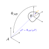

# core
core is a vision perception stack used at the NTNU FRL.

## Building
Release build:
```
cmake -B build -DCMAKE_BUILD_TYPE=Release
```
or debug build:
```
cmake -B build -DCMAKE_BUILD_TYPE=Debug
```
and then build with:
```
cmake --build build
```

### Requirements Jetson
```
sudo apt install ccache \
                 clang-format \
                 clangd \
                 cmake \
                 cuda-toolkit \
                 ffmpeg \
                 gdb \
                 gstreamer1.0-plugins-base \
                 gstreamer1.0-plugins-good \
                 gstreamer1.0-tools \
                 jq \
                 kmod \
                 libboost-dev \
                 libboost-filesystem-dev \
                 libboost-system-dev \
                 libeigen3-dev \
                 libgstreamer-plugins-base1.0-dev \
                 libgtest-dev \
                 libopencv-dev \
                 libspdlog-dev \
                 v4l-utils \
                 zlib1g-dev
```

## Coordinate convention
The stack utilizes passive transformations all throughout the code.
A passive transformation represents a change in frame of reference of e.g. a point, compared to an active transformation, that represent a change of the pose of the point itself.
The nomenclature is $\Phi_{\mathcal{A}\mathcal{B}}$ or in code `phi_A_B`, which is a passive transformation from frame $\mathcal{B}$ to frame $\mathcal{A}$.
It is worth to note that different notations exists (e.g. see [1]), but the advantage of this formulation is that it is very intuitive,
$$\Phi_{\mathcal{A}\mathcal{C}} = \Phi_{\mathcal{A}\mathcal{B}}\Phi_{\mathcal{B}\mathcal{C}}$$
since the $\mathcal{B}$ cancels out.
Therefore we stick to this formulation.

Quaternions or rotation matrices are preferred; use of Euler angles should be motivated carefully and are rarely the best choice.

### On the representation of poses and transformations
As a concrete example and reminder of this convention, let's consider two poses $\mathcal{A}$, $\mathcal{B}$ in inertial frame $\mathcal{I}$, ${}\_\mathcal{I}\Phi_{\mathcal{A}}$, ${}\_\mathcal{I}\Phi_{\mathcal{B}}$.
This is equivalent to writing it as transformations $\Phi_{\mathcal{I}\mathcal{A}}$, $\Phi_{\mathcal{I}\mathcal{B}}$, since in order to obtain the transformation from frame $\mathcal{B}$ to frame $\mathcal{A}$, we can use the following relation:
$$\Phi_{\mathcal{A}\mathcal{B}} = \Phi_{\mathcal{I}\mathcal{A}}^{-1}\Phi_{\mathcal{I}\mathcal{B}}$$

### Quaternions
We use the Hamilton [2] convention and denote $q_0\in\mathbb{R}$ as the real part, and $\mathbf{q}\in\mathbb{R}^3$. Following [1], we denote the transformation then as $\Phi = \left(q_0,\mathbf{q}\right)$.

### References
[1] Bloesch, M., Sommer, H., Laidlow, T., Burri, M., Nuetzi, G., Fankhauser, P., Bellicoso, D., Gehring, C., Leutenegger, S., Hutter, M., & Siegwart, R. (2016). A Primer on the Differential Calculus of 3D Orientations. https://arxiv.org/abs/1606.05285
[2] W. R. Hamilton, “On quaternions; or on a new system of imaginaries in algebra,” The London, Edinburgh, and Dublin Philosophical Magazine and Journal of Science, vol. 25, no. 163, pp. 10–13, 1844
