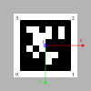

From [Apriltag original repository](https://github.com/AprilRobotics/apriltag?tab=readme-ov-file)
> **Coordinate System**
> The coordinate system has the origin at the camera center. The z-axis points from the camera center out the camera lens. The x-axis is to the right in the image taken by the camera, and y is down. The tag's coordinate frame is centered at the center of the tag. From the viewer's perspective, the x-axis is to the right, y-axis down, and z-axis is into the tag.

and

> ** Corners**
> lb-rb-rt-lt: pixel coordinates of the 4 corners of each detection. The order is left-bottom, right-bottom, right-top, left-top.

therefore in tag frame, the corner order is:
```
[-half_size, half_size, 0]
[half_size, half_size, 0]
[half_size, -half_size, 0]
[-half_size, -half_size, 0]
```

